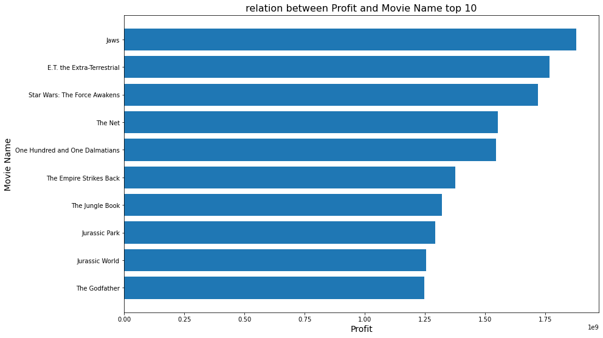
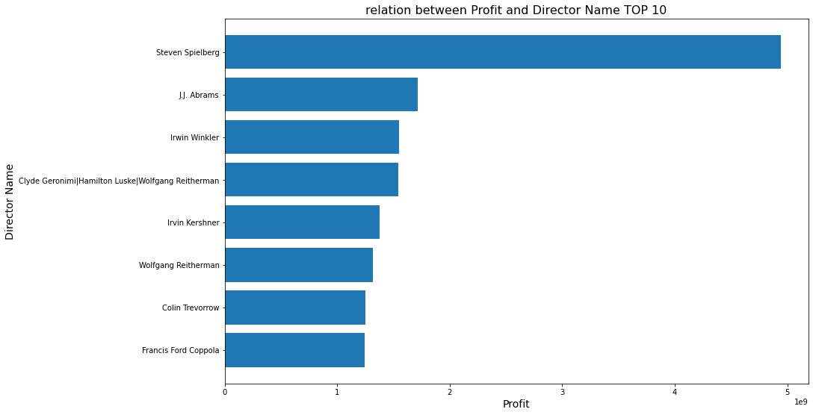
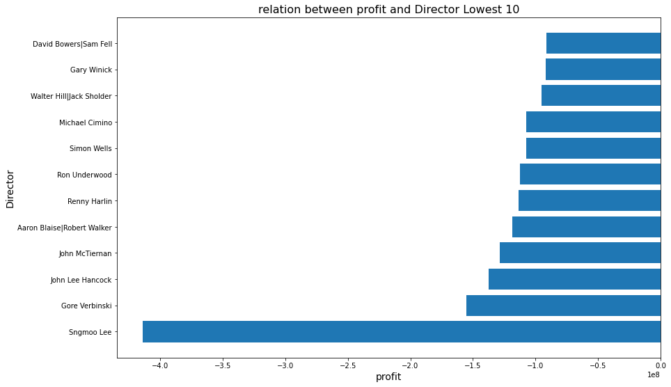
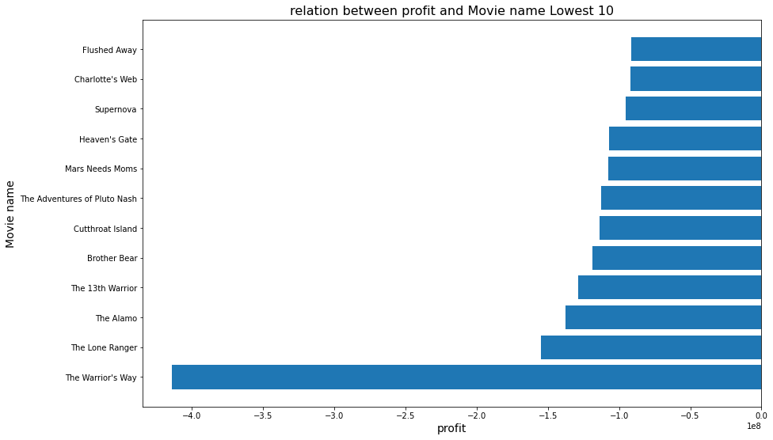
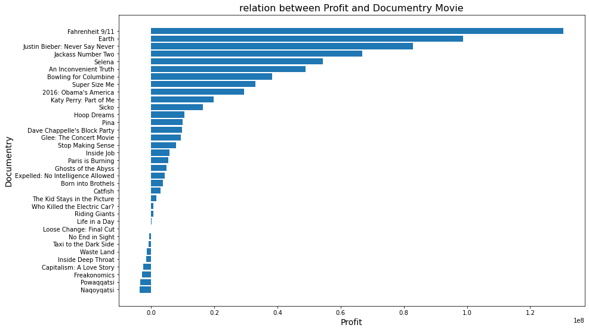
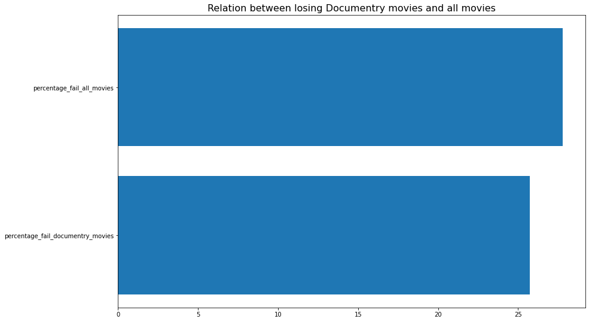
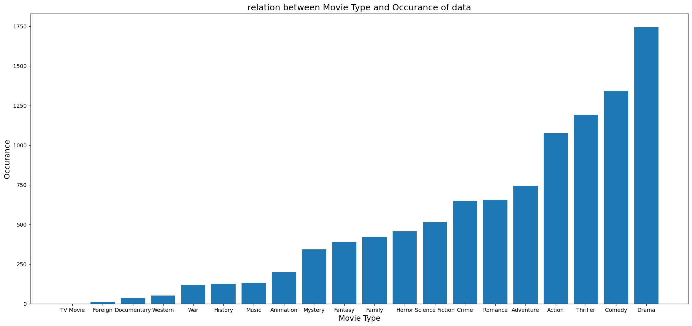
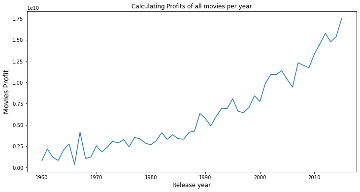

# Project: Investigate a Dataset (Analysing TMDB Movie Data )

## Table of Contents
<ul>
<li><a href="#intro">Introduction</a></li>
<li><a href="#wrangling">Data Wrangling</a></li>
<li><a href="#eda">Exploratory Data Analysis</a></li>
<li><a href="#conclusions">Conclusions</a></li>
</ul>

<a id='intro'></a>
## Introduction

> **TMDB Movie Data**: This data set contains information about 10,000 movies collected from The Movie Database (TMDb), including user ratings and revenue.
>
> **Questions:**
>
> * Which movie has the highest Profit? Which movie has the lowest Profit?
>
> * How many documentary movies there? is investing in it waste money?
>
> * which director, cast, genres are in great demand?
>
> * Movies profits investigation increased or decreased every year? Is it a good investment?


```python
import pandas as pd
import numpy as np
from datetime import datetime
import matplotlib.pyplot as plt
%matplotlib inline
import re
import collections
```

<a id='wrangling'></a>
## Data Wrangling

 Data Cleaning (Replace this with more specific notes!)
> * Remove duplicate Data
> * Some columns we didnot need them [id,imdb_id,popularity]
> * Change data type of release_date  to be date time
> * Change data type of budget_adj and revenue_adj to be Integer as no need for fractions in millions no.
> * Although budget,revenue & budget_adj,revenue_adj has the same information but i will keep both of them as
we need budget,revenue as basic data and need budget_adj,revenue_adj for statistics purboses .
> * Drop all Rows whitch has budget_adj,revenue_adj less than 1000$  as the data seems to be wrong .
> * Some movies run time = 0 but we will do nothing as this column will be removed with rows with 0 budget .


```python
# Load tmdb-movies into pandas 
tmdb_df=pd.read_csv("tmdb-movies.csv")
tmdb_df.head()
```


<div>
<style scoped>
    .dataframe tbody tr th:only-of-type {
        vertical-align: middle;
    }

    .dataframe tbody tr th {
        vertical-align: top;
    }

    .dataframe thead th {
        text-align: right;
    }
</style>
<table border="1" class="dataframe">
  <thead>
    <tr style="text-align: right;">
      <th></th>
      <th>id</th>
      <th>imdb_id</th>
      <th>popularity</th>
      <th>budget</th>
      <th>revenue</th>
      <th>original_title</th>
      <th>cast</th>
      <th>homepage</th>
      <th>director</th>
      <th>tagline</th>
      <th>...</th>
      <th>overview</th>
      <th>runtime</th>
      <th>genres</th>
      <th>production_companies</th>
      <th>release_date</th>
      <th>vote_count</th>
      <th>vote_average</th>
      <th>release_year</th>
      <th>budget_adj</th>
      <th>revenue_adj</th>
    </tr>
  </thead>
  <tbody>
    <tr>
      <th>0</th>
      <td>135397</td>
      <td>tt0369610</td>
      <td>32.985763</td>
      <td>150000000</td>
      <td>1513528810</td>
      <td>Jurassic World</td>
      <td>Chris Pratt|Bryce Dallas Howard|Irrfan Khan|Vi...</td>
      <td>http://www.jurassicworld.com/</td>
      <td>Colin Trevorrow</td>
      <td>The park is open.</td>
      <td>...</td>
      <td>Twenty-two years after the events of Jurassic ...</td>
      <td>124</td>
      <td>Action|Adventure|Science Fiction|Thriller</td>
      <td>Universal Studios|Amblin Entertainment|Legenda...</td>
      <td>6/9/15</td>
      <td>5562</td>
      <td>6.5</td>
      <td>2015</td>
      <td>1.379999e+08</td>
      <td>1.392446e+09</td>
    </tr>
    <tr>
      <th>1</th>
      <td>76341</td>
      <td>tt1392190</td>
      <td>28.419936</td>
      <td>150000000</td>
      <td>378436354</td>
      <td>Mad Max: Fury Road</td>
      <td>Tom Hardy|Charlize Theron|Hugh Keays-Byrne|Nic...</td>
      <td>http://www.madmaxmovie.com/</td>
      <td>George Miller</td>
      <td>What a Lovely Day.</td>
      <td>...</td>
      <td>An apocalyptic story set in the furthest reach...</td>
      <td>120</td>
      <td>Action|Adventure|Science Fiction|Thriller</td>
      <td>Village Roadshow Pictures|Kennedy Miller Produ...</td>
      <td>5/13/15</td>
      <td>6185</td>
      <td>7.1</td>
      <td>2015</td>
      <td>1.379999e+08</td>
      <td>3.481613e+08</td>
    </tr>
    <tr>
      <th>2</th>
      <td>262500</td>
      <td>tt2908446</td>
      <td>13.112507</td>
      <td>110000000</td>
      <td>295238201</td>
      <td>Insurgent</td>
      <td>Shailene Woodley|Theo James|Kate Winslet|Ansel...</td>
      <td>http://www.thedivergentseries.movie/#insurgent</td>
      <td>Robert Schwentke</td>
      <td>One Choice Can Destroy You</td>
      <td>...</td>
      <td>Beatrice Prior must confront her inner demons ...</td>
      <td>119</td>
      <td>Adventure|Science Fiction|Thriller</td>
      <td>Summit Entertainment|Mandeville Films|Red Wago...</td>
      <td>3/18/15</td>
      <td>2480</td>
      <td>6.3</td>
      <td>2015</td>
      <td>1.012000e+08</td>
      <td>2.716190e+08</td>
    </tr>
    <tr>
      <th>3</th>
      <td>140607</td>
      <td>tt2488496</td>
      <td>11.173104</td>
      <td>200000000</td>
      <td>2068178225</td>
      <td>Star Wars: The Force Awakens</td>
      <td>Harrison Ford|Mark Hamill|Carrie Fisher|Adam D...</td>
      <td>http://www.starwars.com/films/star-wars-episod...</td>
      <td>J.J. Abrams</td>
      <td>Every generation has a story.</td>
      <td>...</td>
      <td>Thirty years after defeating the Galactic Empi...</td>
      <td>136</td>
      <td>Action|Adventure|Science Fiction|Fantasy</td>
      <td>Lucasfilm|Truenorth Productions|Bad Robot</td>
      <td>12/15/15</td>
      <td>5292</td>
      <td>7.5</td>
      <td>2015</td>
      <td>1.839999e+08</td>
      <td>1.902723e+09</td>
    </tr>
    <tr>
      <th>4</th>
      <td>168259</td>
      <td>tt2820852</td>
      <td>9.335014</td>
      <td>190000000</td>
      <td>1506249360</td>
      <td>Furious 7</td>
      <td>Vin Diesel|Paul Walker|Jason Statham|Michelle ...</td>
      <td>http://www.furious7.com/</td>
      <td>James Wan</td>
      <td>Vengeance Hits Home</td>
      <td>...</td>
      <td>Deckard Shaw seeks revenge against Dominic Tor...</td>
      <td>137</td>
      <td>Action|Crime|Thriller</td>
      <td>Universal Pictures|Original Film|Media Rights ...</td>
      <td>4/1/15</td>
      <td>2947</td>
      <td>7.3</td>
      <td>2015</td>
      <td>1.747999e+08</td>
      <td>1.385749e+09</td>
    </tr>
  </tbody>
</table>
<p>5 rows × 21 columns</p>
</div>


```python
#review columns 
tmdb_df.info()
```

    <class 'pandas.core.frame.DataFrame'>
    RangeIndex: 10866 entries, 0 to 10865
    Data columns (total 21 columns):
     #   Column                Non-Null Count  Dtype  
    ---  ------                --------------  -----  
     0   id                    10866 non-null  int64  
     1   imdb_id               10856 non-null  object 
     2   popularity            10866 non-null  float64
     3   budget                10866 non-null  int64  
     4   revenue               10866 non-null  int64  
     5   original_title        10866 non-null  object 
     6   cast                  10790 non-null  object 
     7   homepage              2936 non-null   object 
     8   director              10822 non-null  object 
     9   tagline               8042 non-null   object 
     10  keywords              9373 non-null   object 
     11  overview              10862 non-null  object 
     12  runtime               10866 non-null  int64  
     13  genres                10843 non-null  object 
     14  production_companies  9836 non-null   object 
     15  release_date          10866 non-null  object 
     16  vote_count            10866 non-null  int64  
     17  vote_average          10866 non-null  float64
     18  release_year          10866 non-null  int64  
     19  budget_adj            10866 non-null  float64
     20  revenue_adj           10866 non-null  float64
    dtypes: float64(4), int64(6), object(11)
    memory usage: 1.7+ MB
    


```python
# check is there any duplication
tmdb_df.duplicated().value_counts()
```


    False    10865
    True         1
    dtype: int64


```python
# show statistics of whole data
tmdb_df.describe()
```


<div>
<style scoped>
    .dataframe tbody tr th:only-of-type {
        vertical-align: middle;
    }

    .dataframe tbody tr th {
        vertical-align: top;
    }

    .dataframe thead th {
        text-align: right;
    }
</style>
<table border="1" class="dataframe">
  <thead>
    <tr style="text-align: right;">
      <th></th>
      <th>id</th>
      <th>popularity</th>
      <th>budget</th>
      <th>revenue</th>
      <th>runtime</th>
      <th>vote_count</th>
      <th>vote_average</th>
      <th>release_year</th>
      <th>budget_adj</th>
      <th>revenue_adj</th>
    </tr>
  </thead>
  <tbody>
    <tr>
      <th>count</th>
      <td>10866.000000</td>
      <td>10866.000000</td>
      <td>1.086600e+04</td>
      <td>1.086600e+04</td>
      <td>10866.000000</td>
      <td>10866.000000</td>
      <td>10866.000000</td>
      <td>10866.000000</td>
      <td>1.086600e+04</td>
      <td>1.086600e+04</td>
    </tr>
    <tr>
      <th>mean</th>
      <td>66064.177434</td>
      <td>0.646441</td>
      <td>1.462570e+07</td>
      <td>3.982332e+07</td>
      <td>102.070863</td>
      <td>217.389748</td>
      <td>5.974922</td>
      <td>2001.322658</td>
      <td>1.755104e+07</td>
      <td>5.136436e+07</td>
    </tr>
    <tr>
      <th>std</th>
      <td>92130.136561</td>
      <td>1.000185</td>
      <td>3.091321e+07</td>
      <td>1.170035e+08</td>
      <td>31.381405</td>
      <td>575.619058</td>
      <td>0.935142</td>
      <td>12.812941</td>
      <td>3.430616e+07</td>
      <td>1.446325e+08</td>
    </tr>
    <tr>
      <th>min</th>
      <td>5.000000</td>
      <td>0.000065</td>
      <td>0.000000e+00</td>
      <td>0.000000e+00</td>
      <td>0.000000</td>
      <td>10.000000</td>
      <td>1.500000</td>
      <td>1960.000000</td>
      <td>0.000000e+00</td>
      <td>0.000000e+00</td>
    </tr>
    <tr>
      <th>25%</th>
      <td>10596.250000</td>
      <td>0.207583</td>
      <td>0.000000e+00</td>
      <td>0.000000e+00</td>
      <td>90.000000</td>
      <td>17.000000</td>
      <td>5.400000</td>
      <td>1995.000000</td>
      <td>0.000000e+00</td>
      <td>0.000000e+00</td>
    </tr>
    <tr>
      <th>50%</th>
      <td>20669.000000</td>
      <td>0.383856</td>
      <td>0.000000e+00</td>
      <td>0.000000e+00</td>
      <td>99.000000</td>
      <td>38.000000</td>
      <td>6.000000</td>
      <td>2006.000000</td>
      <td>0.000000e+00</td>
      <td>0.000000e+00</td>
    </tr>
    <tr>
      <th>75%</th>
      <td>75610.000000</td>
      <td>0.713817</td>
      <td>1.500000e+07</td>
      <td>2.400000e+07</td>
      <td>111.000000</td>
      <td>145.750000</td>
      <td>6.600000</td>
      <td>2011.000000</td>
      <td>2.085325e+07</td>
      <td>3.369710e+07</td>
    </tr>
    <tr>
      <th>max</th>
      <td>417859.000000</td>
      <td>32.985763</td>
      <td>4.250000e+08</td>
      <td>2.781506e+09</td>
      <td>900.000000</td>
      <td>9767.000000</td>
      <td>9.200000</td>
      <td>2015.000000</td>
      <td>4.250000e+08</td>
      <td>2.827124e+09</td>
    </tr>
  </tbody>
</table>
</div>


### Data Cleaning 
> * Remove duplicate Data
> * Some columns we didnot need them [id,imdb_id,popularity]
> * Change data type of release_date  to be date time
> * Change data type of budget_adj and revenue_adj to be Integer as no need for fractions in millions no.
> * Although budget,revenue & budget_adj,revenue_adj has the same information but i will keep both of them as
we need budget,revenue as basic data and need budget_adj,revenue_adj for statistics purboses .
> * Drop all Rows whitch has budget_adj,revenue_adj less than 100$  as the data seems to be wrong .
> * Some movies run time = 0 but we will do nothing as this column will be removed with rows with 0 budget .


```python
# Make copy of data to clean
tmdb_df_cleaned=tmdb_df.copy()
```


```python
#Drop duplicate values
tmdb_df_cleaned.drop_duplicates(inplace=True)
```


```python
#drop columns that i will not use and contain no important data  [id,imdb_id,popularity] 
tmdb_df_cleaned.drop(columns=['id','imdb_id','popularity'],inplace=True)
```


```python
#test the drop operation 
tmdb_df_cleaned.head(2)
```


<div>
<style scoped>
    .dataframe tbody tr th:only-of-type {
        vertical-align: middle;
    }

    .dataframe tbody tr th {
        vertical-align: top;
    }

    .dataframe thead th {
        text-align: right;
    }
</style>
<table border="1" class="dataframe">
  <thead>
    <tr style="text-align: right;">
      <th></th>
      <th>budget</th>
      <th>revenue</th>
      <th>original_title</th>
      <th>cast</th>
      <th>homepage</th>
      <th>director</th>
      <th>tagline</th>
      <th>keywords</th>
      <th>overview</th>
      <th>runtime</th>
      <th>genres</th>
      <th>production_companies</th>
      <th>release_date</th>
      <th>vote_count</th>
      <th>vote_average</th>
      <th>release_year</th>
      <th>budget_adj</th>
      <th>revenue_adj</th>
    </tr>
  </thead>
  <tbody>
    <tr>
      <th>0</th>
      <td>150000000</td>
      <td>1513528810</td>
      <td>Jurassic World</td>
      <td>Chris Pratt|Bryce Dallas Howard|Irrfan Khan|Vi...</td>
      <td>http://www.jurassicworld.com/</td>
      <td>Colin Trevorrow</td>
      <td>The park is open.</td>
      <td>monster|dna|tyrannosaurus rex|velociraptor|island</td>
      <td>Twenty-two years after the events of Jurassic ...</td>
      <td>124</td>
      <td>Action|Adventure|Science Fiction|Thriller</td>
      <td>Universal Studios|Amblin Entertainment|Legenda...</td>
      <td>6/9/15</td>
      <td>5562</td>
      <td>6.5</td>
      <td>2015</td>
      <td>1.379999e+08</td>
      <td>1.392446e+09</td>
    </tr>
    <tr>
      <th>1</th>
      <td>150000000</td>
      <td>378436354</td>
      <td>Mad Max: Fury Road</td>
      <td>Tom Hardy|Charlize Theron|Hugh Keays-Byrne|Nic...</td>
      <td>http://www.madmaxmovie.com/</td>
      <td>George Miller</td>
      <td>What a Lovely Day.</td>
      <td>future|chase|post-apocalyptic|dystopia|australia</td>
      <td>An apocalyptic story set in the furthest reach...</td>
      <td>120</td>
      <td>Action|Adventure|Science Fiction|Thriller</td>
      <td>Village Roadshow Pictures|Kennedy Miller Produ...</td>
      <td>5/13/15</td>
      <td>6185</td>
      <td>7.1</td>
      <td>2015</td>
      <td>1.379999e+08</td>
      <td>3.481613e+08</td>
    </tr>
  </tbody>
</table>
</div>


```python
#Change Data type of  release_date to date time
tmdb_df_cleaned['release_date']=pd.to_datetime(tmdb_df_cleaned['release_date'])
tmdb_df_cleaned.head(2)
```


<div>
<style scoped>
    .dataframe tbody tr th:only-of-type {
        vertical-align: middle;
    }

    .dataframe tbody tr th {
        vertical-align: top;
    }

    .dataframe thead th {
        text-align: right;
    }
</style>
<table border="1" class="dataframe">
  <thead>
    <tr style="text-align: right;">
      <th></th>
      <th>budget</th>
      <th>revenue</th>
      <th>original_title</th>
      <th>cast</th>
      <th>homepage</th>
      <th>director</th>
      <th>tagline</th>
      <th>keywords</th>
      <th>overview</th>
      <th>runtime</th>
      <th>genres</th>
      <th>production_companies</th>
      <th>release_date</th>
      <th>vote_count</th>
      <th>vote_average</th>
      <th>release_year</th>
      <th>budget_adj</th>
      <th>revenue_adj</th>
    </tr>
  </thead>
  <tbody>
    <tr>
      <th>0</th>
      <td>150000000</td>
      <td>1513528810</td>
      <td>Jurassic World</td>
      <td>Chris Pratt|Bryce Dallas Howard|Irrfan Khan|Vi...</td>
      <td>http://www.jurassicworld.com/</td>
      <td>Colin Trevorrow</td>
      <td>The park is open.</td>
      <td>monster|dna|tyrannosaurus rex|velociraptor|island</td>
      <td>Twenty-two years after the events of Jurassic ...</td>
      <td>124</td>
      <td>Action|Adventure|Science Fiction|Thriller</td>
      <td>Universal Studios|Amblin Entertainment|Legenda...</td>
      <td>2015-06-09</td>
      <td>5562</td>
      <td>6.5</td>
      <td>2015</td>
      <td>1.379999e+08</td>
      <td>1.392446e+09</td>
    </tr>
    <tr>
      <th>1</th>
      <td>150000000</td>
      <td>378436354</td>
      <td>Mad Max: Fury Road</td>
      <td>Tom Hardy|Charlize Theron|Hugh Keays-Byrne|Nic...</td>
      <td>http://www.madmaxmovie.com/</td>
      <td>George Miller</td>
      <td>What a Lovely Day.</td>
      <td>future|chase|post-apocalyptic|dystopia|australia</td>
      <td>An apocalyptic story set in the furthest reach...</td>
      <td>120</td>
      <td>Action|Adventure|Science Fiction|Thriller</td>
      <td>Village Roadshow Pictures|Kennedy Miller Produ...</td>
      <td>2015-05-13</td>
      <td>6185</td>
      <td>7.1</td>
      <td>2015</td>
      <td>1.379999e+08</td>
      <td>3.481613e+08</td>
    </tr>
  </tbody>
</table>
</div>


```python
#test Data type of  release_date
tmdb_df_cleaned.info()
```

    <class 'pandas.core.frame.DataFrame'>
    Int64Index: 10865 entries, 0 to 10865
    Data columns (total 18 columns):
     #   Column                Non-Null Count  Dtype         
    ---  ------                --------------  -----         
     0   budget                10865 non-null  int64         
     1   revenue               10865 non-null  int64         
     2   original_title        10865 non-null  object        
     3   cast                  10789 non-null  object        
     4   homepage              2936 non-null   object        
     5   director              10821 non-null  object        
     6   tagline               8041 non-null   object        
     7   keywords              9372 non-null   object        
     8   overview              10861 non-null  object        
     9   runtime               10865 non-null  int64         
     10  genres                10842 non-null  object        
     11  production_companies  9835 non-null   object        
     12  release_date          10865 non-null  datetime64[ns]
     13  vote_count            10865 non-null  int64         
     14  vote_average          10865 non-null  float64       
     15  release_year          10865 non-null  int64         
     16  budget_adj            10865 non-null  float64       
     17  revenue_adj           10865 non-null  float64       
    dtypes: datetime64[ns](1), float64(3), int64(5), object(9)
    memory usage: 1.6+ MB
    


```python
#Change data type of budget_adj and revenue_adj to be Integer as no need for fractions in millions or billions .
col=['budget_adj','revenue_adj']
tmdb_df_cleaned[col]=tmdb_df_cleaned[col].astype(int)
tmdb_df_cleaned.head(2)
```


<div>
<style scoped>
    .dataframe tbody tr th:only-of-type {
        vertical-align: middle;
    }

    .dataframe tbody tr th {
        vertical-align: top;
    }

    .dataframe thead th {
        text-align: right;
    }
</style>
<table border="1" class="dataframe">
  <thead>
    <tr style="text-align: right;">
      <th></th>
      <th>budget</th>
      <th>revenue</th>
      <th>original_title</th>
      <th>cast</th>
      <th>homepage</th>
      <th>director</th>
      <th>tagline</th>
      <th>keywords</th>
      <th>overview</th>
      <th>runtime</th>
      <th>genres</th>
      <th>production_companies</th>
      <th>release_date</th>
      <th>vote_count</th>
      <th>vote_average</th>
      <th>release_year</th>
      <th>budget_adj</th>
      <th>revenue_adj</th>
    </tr>
  </thead>
  <tbody>
    <tr>
      <th>0</th>
      <td>150000000</td>
      <td>1513528810</td>
      <td>Jurassic World</td>
      <td>Chris Pratt|Bryce Dallas Howard|Irrfan Khan|Vi...</td>
      <td>http://www.jurassicworld.com/</td>
      <td>Colin Trevorrow</td>
      <td>The park is open.</td>
      <td>monster|dna|tyrannosaurus rex|velociraptor|island</td>
      <td>Twenty-two years after the events of Jurassic ...</td>
      <td>124</td>
      <td>Action|Adventure|Science Fiction|Thriller</td>
      <td>Universal Studios|Amblin Entertainment|Legenda...</td>
      <td>2015-06-09</td>
      <td>5562</td>
      <td>6.5</td>
      <td>2015</td>
      <td>137999939</td>
      <td>1392445892</td>
    </tr>
    <tr>
      <th>1</th>
      <td>150000000</td>
      <td>378436354</td>
      <td>Mad Max: Fury Road</td>
      <td>Tom Hardy|Charlize Theron|Hugh Keays-Byrne|Nic...</td>
      <td>http://www.madmaxmovie.com/</td>
      <td>George Miller</td>
      <td>What a Lovely Day.</td>
      <td>future|chase|post-apocalyptic|dystopia|australia</td>
      <td>An apocalyptic story set in the furthest reach...</td>
      <td>120</td>
      <td>Action|Adventure|Science Fiction|Thriller</td>
      <td>Village Roadshow Pictures|Kennedy Miller Produ...</td>
      <td>2015-05-13</td>
      <td>6185</td>
      <td>7.1</td>
      <td>2015</td>
      <td>137999939</td>
      <td>348161292</td>
    </tr>
  </tbody>
</table>
</div>


```python
#test Change data type of budget_adj and revenue_adj
tmdb_df_cleaned.info()
```

    <class 'pandas.core.frame.DataFrame'>
    Int64Index: 10865 entries, 0 to 10865
    Data columns (total 18 columns):
     #   Column                Non-Null Count  Dtype         
    ---  ------                --------------  -----         
     0   budget                10865 non-null  int64         
     1   revenue               10865 non-null  int64         
     2   original_title        10865 non-null  object        
     3   cast                  10789 non-null  object        
     4   homepage              2936 non-null   object        
     5   director              10821 non-null  object        
     6   tagline               8041 non-null   object        
     7   keywords              9372 non-null   object        
     8   overview              10861 non-null  object        
     9   runtime               10865 non-null  int64         
     10  genres                10842 non-null  object        
     11  production_companies  9835 non-null   object        
     12  release_date          10865 non-null  datetime64[ns]
     13  vote_count            10865 non-null  int64         
     14  vote_average          10865 non-null  float64       
     15  release_year          10865 non-null  int64         
     16  budget_adj            10865 non-null  int32         
     17  revenue_adj           10865 non-null  int32         
    dtypes: datetime64[ns](1), float64(1), int32(2), int64(5), object(9)
    memory usage: 1.5+ MB
    


```python
# drop all data >100$ in budget_adj and revenue_adj
tmdb_df_cleaned=tmdb_df_cleaned[(tmdb_df_cleaned['budget_adj']>100) & (tmdb_df_cleaned['revenue_adj']>100)]
tmdb_df_cleaned.head(2)
```


<div>
<style scoped>
    .dataframe tbody tr th:only-of-type {
        vertical-align: middle;
    }

    .dataframe tbody tr th {
        vertical-align: top;
    }

    .dataframe thead th {
        text-align: right;
    }
</style>
<table border="1" class="dataframe">
  <thead>
    <tr style="text-align: right;">
      <th></th>
      <th>budget</th>
      <th>revenue</th>
      <th>original_title</th>
      <th>cast</th>
      <th>homepage</th>
      <th>director</th>
      <th>tagline</th>
      <th>keywords</th>
      <th>overview</th>
      <th>runtime</th>
      <th>genres</th>
      <th>production_companies</th>
      <th>release_date</th>
      <th>vote_count</th>
      <th>vote_average</th>
      <th>release_year</th>
      <th>budget_adj</th>
      <th>revenue_adj</th>
    </tr>
  </thead>
  <tbody>
    <tr>
      <th>0</th>
      <td>150000000</td>
      <td>1513528810</td>
      <td>Jurassic World</td>
      <td>Chris Pratt|Bryce Dallas Howard|Irrfan Khan|Vi...</td>
      <td>http://www.jurassicworld.com/</td>
      <td>Colin Trevorrow</td>
      <td>The park is open.</td>
      <td>monster|dna|tyrannosaurus rex|velociraptor|island</td>
      <td>Twenty-two years after the events of Jurassic ...</td>
      <td>124</td>
      <td>Action|Adventure|Science Fiction|Thriller</td>
      <td>Universal Studios|Amblin Entertainment|Legenda...</td>
      <td>2015-06-09</td>
      <td>5562</td>
      <td>6.5</td>
      <td>2015</td>
      <td>137999939</td>
      <td>1392445892</td>
    </tr>
    <tr>
      <th>1</th>
      <td>150000000</td>
      <td>378436354</td>
      <td>Mad Max: Fury Road</td>
      <td>Tom Hardy|Charlize Theron|Hugh Keays-Byrne|Nic...</td>
      <td>http://www.madmaxmovie.com/</td>
      <td>George Miller</td>
      <td>What a Lovely Day.</td>
      <td>future|chase|post-apocalyptic|dystopia|australia</td>
      <td>An apocalyptic story set in the furthest reach...</td>
      <td>120</td>
      <td>Action|Adventure|Science Fiction|Thriller</td>
      <td>Village Roadshow Pictures|Kennedy Miller Produ...</td>
      <td>2015-05-13</td>
      <td>6185</td>
      <td>7.1</td>
      <td>2015</td>
      <td>137999939</td>
      <td>348161292</td>
    </tr>
  </tbody>
</table>
</div>


```python
#test the drop operation 
tmdb_df_cleaned.info()
```

    <class 'pandas.core.frame.DataFrame'>
    Int64Index: 3820 entries, 0 to 10848
    Data columns (total 18 columns):
     #   Column                Non-Null Count  Dtype         
    ---  ------                --------------  -----         
     0   budget                3820 non-null   int64         
     1   revenue               3820 non-null   int64         
     2   original_title        3820 non-null   object        
     3   cast                  3816 non-null   object        
     4   homepage              1412 non-null   object        
     5   director              3819 non-null   object        
     6   tagline               3547 non-null   object        
     7   keywords              3687 non-null   object        
     8   overview              3820 non-null   object        
     9   runtime               3820 non-null   int64         
     10  genres                3820 non-null   object        
     11  production_companies  3776 non-null   object        
     12  release_date          3820 non-null   datetime64[ns]
     13  vote_count            3820 non-null   int64         
     14  vote_average          3820 non-null   float64       
     15  release_year          3820 non-null   int64         
     16  budget_adj            3820 non-null   int32         
     17  revenue_adj           3820 non-null   int32         
    dtypes: datetime64[ns](1), float64(1), int32(2), int64(5), object(9)
    memory usage: 537.2+ KB
    

<a id='eda'></a>
## Exploratory Data Analysis

> **Questions:**
>
> * Which movie has the highest Profit? Which movie has the lowest Profit?
>
> * How many documentary movies there? is investing in it waste money?
>
> * which director, cast, genres are in great demand?
>
> * Movies profits investigation increased or decreased every year? Is it a good investment?

### Research Question 1 (Which movie has the highest Profit? Which movie has the lowest Profit?)


```python
# calculate the profit for all  movies
tmdb_df_cleaned['profit']=tmdb_df_cleaned['revenue_adj']-tmdb_df_cleaned['budget_adj']
```


```python
# movie with highest profit is 'Jaws' with profit 1878643093
tmdb_df_cleaned[tmdb_df_cleaned['profit']==tmdb_df_cleaned['profit'].max()]
```


<div>
<style scoped>
    .dataframe tbody tr th:only-of-type {
        vertical-align: middle;
    }

    .dataframe tbody tr th {
        vertical-align: top;
    }

    .dataframe thead th {
        text-align: right;
    }
</style>
<table border="1" class="dataframe">
  <thead>
    <tr style="text-align: right;">
      <th></th>
      <th>budget</th>
      <th>revenue</th>
      <th>original_title</th>
      <th>cast</th>
      <th>homepage</th>
      <th>director</th>
      <th>tagline</th>
      <th>keywords</th>
      <th>overview</th>
      <th>runtime</th>
      <th>genres</th>
      <th>production_companies</th>
      <th>release_date</th>
      <th>vote_count</th>
      <th>vote_average</th>
      <th>release_year</th>
      <th>budget_adj</th>
      <th>revenue_adj</th>
      <th>profit</th>
    </tr>
  </thead>
  <tbody>
    <tr>
      <th>9806</th>
      <td>7000000</td>
      <td>470654000</td>
      <td>Jaws</td>
      <td>Roy Scheider|Robert Shaw|Richard Dreyfuss|Lorr...</td>
      <td>http://www.jaws25.com/</td>
      <td>Steven Spielberg</td>
      <td>Don't go in the water.</td>
      <td>fishing|atlantic ocean|bathing|shipwreck|polic...</td>
      <td>An insatiable great white shark terrorizes the...</td>
      <td>124</td>
      <td>Horror|Thriller|Adventure</td>
      <td>Universal Pictures|Zanuck/Brown Productions</td>
      <td>1975-06-18</td>
      <td>1415</td>
      <td>7.3</td>
      <td>1975</td>
      <td>28362748</td>
      <td>1907005841</td>
      <td>1878643093</td>
    </tr>
  </tbody>
</table>
</div>


```python
tmdb_df_cleaned['profit'].describe()
```


    count    3.820000e+03
    mean     9.114745e+07
    std      1.793274e+08
    min     -4.139124e+08
    25%     -1.503876e+06
    50%      2.802600e+07
    75%      1.079638e+08
    max      1.878643e+09
    Name: profit, dtype: float64


```python
# movie with lowest profit is "The Warrior's Way" movie lose 413912431 $ 
tmdb_df_cleaned[tmdb_df_cleaned['profit']==tmdb_df_cleaned['profit'].min()]
```


<div>
<style scoped>
    .dataframe tbody tr th:only-of-type {
        vertical-align: middle;
    }

    .dataframe tbody tr th {
        vertical-align: top;
    }

    .dataframe thead th {
        text-align: right;
    }
</style>
<table border="1" class="dataframe">
  <thead>
    <tr style="text-align: right;">
      <th></th>
      <th>budget</th>
      <th>revenue</th>
      <th>original_title</th>
      <th>cast</th>
      <th>homepage</th>
      <th>director</th>
      <th>tagline</th>
      <th>keywords</th>
      <th>overview</th>
      <th>runtime</th>
      <th>genres</th>
      <th>production_companies</th>
      <th>release_date</th>
      <th>vote_count</th>
      <th>vote_average</th>
      <th>release_year</th>
      <th>budget_adj</th>
      <th>revenue_adj</th>
      <th>profit</th>
    </tr>
  </thead>
  <tbody>
    <tr>
      <th>2244</th>
      <td>425000000</td>
      <td>11087569</td>
      <td>The Warrior's Way</td>
      <td>Kate Bosworth|Jang Dong-gun|Geoffrey Rush|Dann...</td>
      <td>http://www.iamrogue.com/thewarriorsway</td>
      <td>Sngmoo Lee</td>
      <td>Assassin. Hero. Legend.</td>
      <td>assassin|small town|revenge|deception|super speed</td>
      <td>An Asian assassin (Dong-gun Jang) is forced to...</td>
      <td>100</td>
      <td>Adventure|Fantasy|Action|Western|Thriller</td>
      <td>Boram Entertainment Inc.</td>
      <td>2010-12-02</td>
      <td>74</td>
      <td>6.4</td>
      <td>2010</td>
      <td>425000000</td>
      <td>11087569</td>
      <td>-413912431</td>
    </tr>
  </tbody>
</table>
</div>


```python
# Get highest 10 movie in profit
tmdb_df_cleaned['profit'].nlargest(10)
```


    9806     1878643093
    8889     1767968064
    3        1718723210
    8094     1551568265
    10110    1545635295
    7309     1376997526
    10398    1319404004
    10223    1293766704
    0        1254445953
    7269     1246626367
    Name: profit, dtype: int32


```python
#get top_10  in pandas data frame
tmdb_top_10_revenue=tmdb_df_cleaned[lambda x :x['profit'] >= 1246626367]
tmdb_top_10_revenue.groupby('original_title')['profit'].sum()
```


    original_title
    E.T. the Extra-Terrestrial        1767968064
    Jaws                              1878643093
    Jurassic Park                     1293766704
    Jurassic World                    1254445953
    One Hundred and One Dalmatians    1545635295
    Star Wars: The Force Awakens      1718723210
    The Empire Strikes Back           1376997526
    The Godfather                     1246626367
    The Jungle Book                   1319404004
    The Net                           1551568265
    Name: profit, dtype: int32


```python
# Get lowest 10 movie in profit
tmdb_df_cleaned['profit'].nsmallest(10)
```


    2244   -413912431
    5508   -155110171
    7031   -137586847
    2435   -128681336
    4970   -118534968
    8102   -113737078
    4078   -112614267
    3484   -107610203
    7332   -107205950
    8765    -95189608
    Name: profit, dtype: int32


```python
#get min_10  in pandas data frame
tmdb_min_10_revenue=tmdb_df_cleaned[lambda x :x['profit'] <= -91445050]
tmdb_min_10_revenue.groupby('original_title')['profit'].sum()
```


    original_title
    Brother Bear                   -118534968
    Charlotte's Web                 -91941723
    Cutthroat Island               -113737078
    Flushed Away                    -91445050
    Heaven's Gate                  -107205950
    Mars Needs Moms                -107610203
    Supernova                       -95189608
    The 13th Warrior               -128681336
    The Adventures of Pluto Nash   -112614267
    The Alamo                      -137586847
    The Lone Ranger                -155110171
    The Warrior's Way              -413912431
    Name: profit, dtype: int32


```python
#Function to plot relation between x , y get list and labels
def plot_relation_rate(stage,xlabel,ylabel,message):
    stage=stage.sort_values()
    plt.figure(figsize=(14, 9))
    plt.barh(stage.index,stage.array)
    plt.xlabel(xlabel, fontsize = 14)
    plt.ylabel(ylabel, fontsize = 14)
    plt.title('relation between {} and {} {}'.format(xlabel,ylabel,message), fontsize = 16)
    #plt.gca().invert_yaxis()
    plt.show();
```


```python
# plot  highest 10 movie name 
top_stage=tmdb_top_10_revenue.groupby(['original_title'])['profit'].sum()
plot_relation_rate(top_stage,'Profit','Movie Name',"top 10")
```





```python
# plot  highest 10 directors with highest profit 
top_stage=tmdb_top_10_revenue.groupby(['director'])['profit'].sum()
plot_relation_rate(top_stage,'Profit','Director Name',"TOP 10")
```





```python
# plot  lowest 10 directors with lowest profit 
top_stage=tmdb_min_10_revenue.groupby(['director'])['profit'].sum()
plot_relation_rate(top_stage,'profit','Director','Lowest 10')
```





```python
# plot  lowest 10 movies name with lowest profit 
top_stage=tmdb_min_10_revenue.groupby(['original_title'])['profit'].sum()
plot_relation_rate(top_stage,'profit','Movie name',"Lowest 10")
```





### Research Question 2  (How many documentary movies there? is investing in it waste money?)


```python
# How many documentry movie ? there are 35 .
tmdb_df=tmdb_df_cleaned[tmdb_df_cleaned['genres'].str.contains('Documentary')]
tmdb_df.info()
```

    <class 'pandas.core.frame.DataFrame'>
    Int64Index: 35 entries, 1542 to 10093
    Data columns (total 19 columns):
     #   Column                Non-Null Count  Dtype         
    ---  ------                --------------  -----         
     0   budget                35 non-null     int64         
     1   revenue               35 non-null     int64         
     2   original_title        35 non-null     object        
     3   cast                  31 non-null     object        
     4   homepage              22 non-null     object        
     5   director              35 non-null     object        
     6   tagline               28 non-null     object        
     7   keywords              34 non-null     object        
     8   overview              35 non-null     object        
     9   runtime               35 non-null     int64         
     10  genres                35 non-null     object        
     11  production_companies  28 non-null     object        
     12  release_date          35 non-null     datetime64[ns]
     13  vote_count            35 non-null     int64         
     14  vote_average          35 non-null     float64       
     15  release_year          35 non-null     int64         
     16  budget_adj            35 non-null     int32         
     17  revenue_adj           35 non-null     int32         
     18  profit                35 non-null     int32         
    dtypes: datetime64[ns](1), float64(1), int32(3), int64(5), object(9)
    memory usage: 5.1+ KB
    


```python
# there is about 35 documentary movie and the relation between profit and movies
top_stage=tmdb_df.groupby(['original_title'])['profit'].sum()
plot_relation_rate(top_stage,'Profit','Documentry',"Movie")
```





> ####  From the figure we found that most of documentry movie has a good rate in profit
> * Let's found the relation between percentage of all losing movies  and losing documentary movies


```python
#compare the precentage of losing movies budget>revenue  in both all movies and documentry movies
fail_d_movies=tmdb_df[tmdb_df['profit']<=0].count().max()
all_d_movies=tmdb_df['profit'].count().max()
percentage_fail_documentry_movies=(fail_d_movies/all_d_movies)*100
percentage_fail_all_movies=((tmdb_df_cleaned[tmdb_df_cleaned['profit']<=0].count().max())/(tmdb_df_cleaned['profit'].count().max()))*100
plt.figure(figsize=(14, 9))
plt.barh(['percentage_fail_documentry_movies','percentage_fail_all_movies'],[percentage_fail_documentry_movies,percentage_fail_all_movies])
plt.title('Relation between losing Documentry movies and all movies', fontsize = 16)
plt.show();
```





```python
print ("The percentage_fail_documentry_movies = ",percentage_fail_documentry_movies,'and percentage_fail_all_movies =',percentage_fail_all_movies)
```

    The percentage_fail_documentry_movies =  25.71428571428571 and percentage_fail_all_movies = 27.801047120418847
    

> ####  From the figure we found that most of documentry movie has a good success rate which is almost less than the loss rate in movies in general we can conclode that this is good investment

### Research Question 3  (which director, cast, genres are in great demand?)


```python
#Function to plot relation between x , y take dictionary variable
def plot_relation_rate_dic(dic,xlabel,ylabel,message):
    type(dic)
    dic=dict(sorted(dic.items(), key=lambda item: item[1]))
    plt.figure(figsize=(22, 10), dpi = 130)
    plt.xlabel(xlabel ,fontsize = 14)
    plt.ylabel(ylabel, fontsize = 14)
    plt.bar(dic.keys(),dic.values())
    plt.title('relation between {} and {} {}'.format(xlabel,ylabel,message), fontsize = 16)
    #plt.gca().invert_yaxis()
    plt.show();
```


```python
#function to count each row in data frame column  and his occurance using regular expression
def data_occurance_rate_due_profit(data):
    temparr={}
    for item in data:
        try:
            data_temp=re.search(r'[\w\W]+',item).group().split('|')
           # print(data_temp)
            for item in data_temp:
                if(item in temparr):
                    temparr[item]=temparr[item]+1
                else:
                    temparr[item]=1
        except :
            continue
    return temparr
```


```python
#Get most wanted movies geners and sort them with largest
geners=data_occurance_rate_due_profit(tmdb_df_cleaned['genres'])
dict(sorted(geners.items(), key=lambda item: item[1], reverse=True))
```


    {'Drama': 1744,
     'Comedy': 1343,
     'Thriller': 1193,
     'Action': 1076,
     'Adventure': 744,
     'Romance': 657,
     'Crime': 649,
     'Science Fiction': 515,
     'Horror': 457,
     'Family': 424,
     'Fantasy': 392,
     'Mystery': 343,
     'Animation': 200,
     'Music': 133,
     'History': 128,
     'War': 119,
     'Western': 52,
     'Documentary': 35,
     'Foreign': 13,
     'TV Movie': 1}


> #### As we can see Drama then Comedy in a great demand


```python
# plot bar diagram for movie geners
plot_relation_rate_dic(geners,'Movie Type','Occurance',"of data")
```





```python
#Get Cast that  in great demand
cast=data_occurance_rate_due_profit(tmdb_df_cleaned['cast'])
dict(sorted(cast.items(), key=lambda item: item[1], reverse=True))
collections.Counter(dict(sorted(cast.items(), key=lambda item: item[1], reverse=True))).most_common(10)
```


    [('Robert De Niro', 52),
     ('Bruce Willis', 46),
     ('Samuel L. Jackson', 43),
     ('Nicolas Cage', 43),
     ('Matt Damon', 36),
     ('Johnny Depp', 35),
     ('Brad Pitt', 34),
     ('Tom Hanks', 34),
     ('Harrison Ford', 33),
     ('Tom Cruise', 33)]


> #### As we can see 'Robert De Niro' and all above are  in great demand


```python
#Get Director that  in great demand
director=data_occurance_rate_due_profit(tmdb_df_cleaned['director'])
dict(sorted(director.items(), key=lambda item: item[1], reverse=True))
collections.Counter(dict(sorted(director.items(), key=lambda item: item[1], reverse=True))).most_common(10)
```


    [('Steven Spielberg', 28),
     ('Clint Eastwood', 24),
     ('Ridley Scott', 21),
     ('Woody Allen', 18),
     ('Robert Rodriguez', 17),
     ('Tim Burton', 17),
     ('Steven Soderbergh', 17),
     ('Martin Scorsese', 17),
     ('Robert Zemeckis', 15),
     ('Renny Harlin', 15)]


> #### As we can see 'Steven Spielberg' and all above are  in great demand
> * #### we can gather cast and one of the above directors and put them in a drama ,comedy or thrill movie and that will be a great investment

### Research Question 4  (Movies profits investment increased or decreased every year? Is it a good investment?)


```python
# plot the relation between movies profit per year 
profit_per_year=tmdb_df_cleaned.groupby('release_year')['profit'].sum()
plt.figure(figsize=(12,6))
plt.xlabel('Release year',fontsize = 12)
plt.ylabel('Movies Profit',fontsize = 14)
plt.title('Calculating Profits of all movies per year')
plt.plot(profit_per_year)
```


    [<matplotlib.lines.Line2D at 0x23ed6afaa60>]





### As we can see the profits increases every year with excellent rate 

<a id='conclusions'></a>
## Conclusions

> ### Which movie has the highest Profit? Which movie has the lowest Profit?
>
> movie with highest profit is 'Jaws' with profit 1878643093
>
> movie with lowest profit is "The Warrior's Way" movie lose 413912431 
>
> ### How many documentary movies there? is investing in it waste money?
>
>   We have 35 documentary movies
>
>   found that most of documentary movie has a good success rate which is almost less than the loss rate in movies in general.
>
> *   we can conclude that this is good investment
>
> ### which director, cast, genres are in great demand?
>
>   Genres: ‘Drama': 1742, 'Comedy': 1340, 'Thriller': 1192, 'Action': 1074,
>    'Adventure': 741
>
> *   As we can see Drama Then Comedy in a great demand
>
>   Cast: ‘Robert De Niro', 52), ('Bruce Willis', 46), ('Samuel L. Jackson', 3), ('Nicolas Cage', 43), ('Matt Damon', 36),     >   ('Johnny Depp', 35), ('Brad Pitt', 34), ('Tom Hanks', 34), ('Harrison Ford', 33), ('Tom Cruise', 33)
>
> *   As we can see 'Robert De Niro' and all above are in great demand
>
>    Director: Steven Spielberg', 28), ('Clint Eastwood', 24), ('Ridley Scott', 21)
>    ('Woody Allen', 18), ('Robert Rodriguez', 17), ('Tim Burton', 17), ('Steven Soderbergh', 17), ('Martin Scorsese', 17),     >    ('Robert Zemeckis', 15), ('Renny Harlin', 15)]
>
> *   As we can see 'Steven Spielberg' and all above are in great demand
> #### we can gather cast and one director from above and put them in a drama ,comedy or thrill movie and that will be a great investment.
>
> ### Movies profits investment increased or decreased every year? Is it a good investment?
>
>   As we can see the profits increases every year with excellent rate .
>
> #### A list of Web sites, books, forums, blog posts, github repositories, etc. that you referred to or used in creating your submission
> * I use python packeges documentation
>
> * https://stackoverflow.com/
>
> * https://www.geeksforgeeks.org/


```python

```


```python

```
